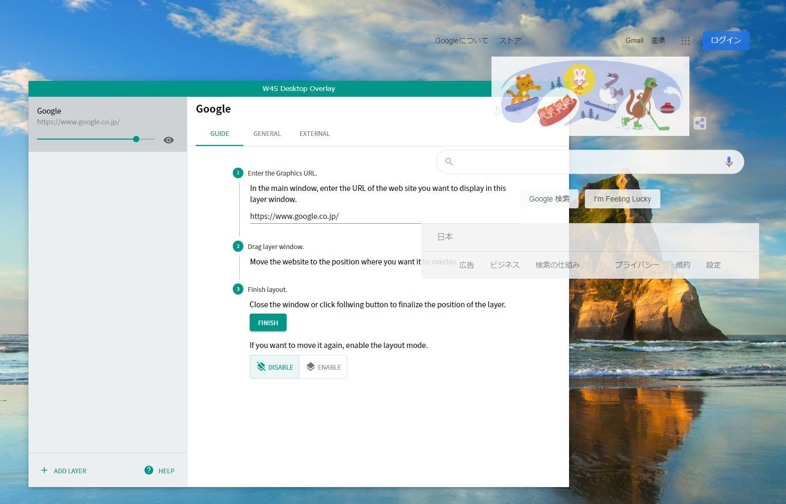

# W4S Desktop Overlay

This is a desktop application for streamers that overlays web pages on your desktop. W4S is an acronym for widgets for streamers.

## Overview

This software overlays multiple web pages on your desktop.
Overlaid desktops can be shared in online meetings such as Teams or Zoom to provide a good experience.
Websites to be overlaid is intended to be a small widget.
For example, clock, agenda, donation, or chat.

## Download

The app installer can be downloaded from GitHub Releases.

[https://github.com/tdc-yamada-ya/w4s-desktop-overlay/releases](https://github.com/tdc-yamada-ya/w4s-desktop-overlay/releases)

## Usage

### Add Layer

1. Press the "ADD LAYER" button.
1. Enter website URL to overlay. Entered web page will be displayed transparently on the entire primary monitor.
1. Adjust an opacity 💧 slider.

### Other

- You can adjust the position of the layer from the Settings button and move to other display.
